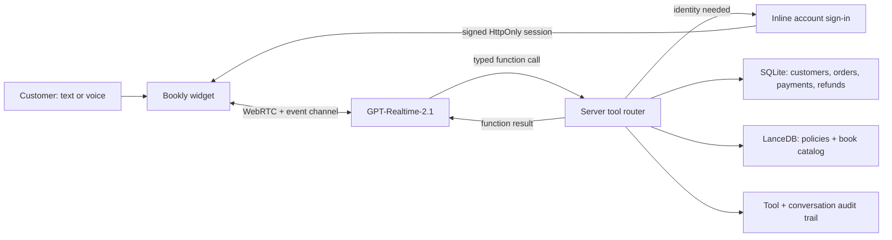

# Bookly Realtime Support Agent

A focused prototype for Decagon's Solutions Engineering take-home. It pairs a convincing bookstore storefront with an embedded customer-support and commerce agent powered by OpenAI `gpt-realtime-2.1`. Customers can type or speak, explore the catalog, build a synchronized cart, manage wishlist alerts, modify eligible orders, investigate shipments, create returns or replacements, complete guarded refunds, and escalate to simulated human support against real SQLite state.

## Thesis

Great CX automation should be conversational at the surface and deterministic at the point of consequence. The model owns dialogue, clarification, and tool selection. Typed schemas, identity checks, policy retrieval, one-time confirmation tokens, database constraints, and transactions own truth and side effects.

That separation lets the agent feel natural without letting natural language bypass business rules.

## Run locally

Requirements: Node.js 22.13+ and an OpenAI API key with access to `gpt-realtime-2.1`.

```bash
npm install
```

Set `OPENAI_API_KEY` and a long random `BOOKLY_SESSION_SECRET` in your shell or copy `.env.example` to `.env.local`, then:

```bash
npm run db:reset
npm run dev
```

Open [http://localhost:3000](http://localhost:3000). The chat is open by default in the lower-right corner. Voice access is requested only when the microphone button is selected. Voice mode uses semantic turn detection: the customer can pause naturally to finish a turn, see a live transcript in their own message bubble, and interrupt an agent response simply by speaking again.

Use the reset icon in the chat header to restore carts, alerts, wishlists, order actions, returns, replacements, support cases, refunds, investigations, conversations, and tool traces to the seeded baseline. The action requires confirmation and starts a new browser session after it completes.

To run the optimized standalone build locally:

```bash
npm run build
npm start
```

The app also ships as a conventional Node container:

```bash
docker build -t bookly-agent .
docker run --rm -p 3000:3000 -e OPENAI_API_KEY=your_key_here -e BOOKLY_SESSION_SECRET=your_random_secret -v bookly-data:/app/data bookly-agent
```

## Two-minute demo path

1. Select **Add A Glass Horizon to my cart**. The agent resolves canonical variants, asks which format, and adds it. The storefront bag count and drawer update immediately; no sign-in is needed.
2. Ask `Make that two copies`, then `Remove it`. The agent reads the current cart item ID before applying each exact mutation. Expand the tool cards to inspect inputs, outputs, totals, and latency.
3. Ask `Recommend a science fiction book and add the hardcover`. The agent uses semantic discovery for the recommendation and structured catalog lookup for the purchasable variant.
4. Sign in with `maya.chen@example.com` and any non-empty password, then ask `Start checkout`. The concierge remains live on the checkout page, reviews Maya's saved demo card, address, items, and final total, and can submit the order after a separate explicit confirmation. Maya can also press **Pay** directly. Either path simulates approval, creates a normal processing order, records the payment, decrements inventory, and closes the cart.
5. Ask `Where is order 5678?`. The reusable inline sign-in form keeps credentials outside the model conversation.
6. Ask for a replacement, return label, or refund for an exact line. Each consequential action summarizes the proposal and waits for explicit confirmation.
7. Say `I want to speak with a person`. The agent creates an evidence-rich case summary, then queues a human handoff with the returned wait estimate.
8. Select the microphone and try the same flows by voice; semantic VAD supports natural turn completion and interruption.

Shipping-investigation path:

1. Say: `Order 5678 says delivered, but I can't find it.`
2. Verify with `maya.chen@example.com`, then confirm that household members, neighbors, and safe delivery locations were checked.
3. The agent runs a shipment diagnostic and displays four simulated USPS scans.
4. Confirm that Bookly should open the case. The agent persists a single simulated carrier investigation and returns its Bookly case ID, carrier reference, and expected response date.

Seeded records:

| Order | Email | Status | Best use |
| --- | --- | --- | --- |
| `1234` | `maya.chen@example.com` | In transit | Verified status and tracking |
| `5678` | `maya.chen@example.com` | Delivered | Partial or full refund |
| `2468` | `theo.rivera@example.com` | Processing | Not-yet-shipped order |

## Architecture



- The permanent OpenAI key stays on the server. The browser posts its SDP offer to `/api/realtime`; the server creates the OpenAI WebRTC call and returns only the SDP answer.
- Account tools never trust credentials supplied by the model. The agent invokes `authenticate_customer`, a reusable inline form collects email and password outside the model conversation, and the server binds the matching customer ID to the current browser session in a signed HttpOnly cookie. The site header and chat share that state, while every protected tool resolves ownership from the server-verified session.
- The Realtime conversation holds immediate dialogue context. Messages and tool traces are also stored by browser session and restored after refresh.
- Policy Markdown and eight fictional books with verbose descriptions are embedded into a local LanceDB table. Every query requires either the `books` or `policy` prefilter; book queries can also filter exact, case-insensitive `book_type`, `author`, and `genre` metadata. The seed step uses `text-embedding-3-small` when the OpenAI key is available and falls back to deterministic local vectors for offline tests.
- Refunds use `prepare_refund` followed by `process_refund`. A short-lived, one-time quote token bridges the two calls and the final mutation runs in a SQLite transaction.
- Shipping investigations follow the same guarded pattern: `investigate_shipment` returns carrier scans, policy signals, and a short-lived quote; `open_shipping_investigation` revalidates and persists exactly one simulated carrier case after confirmation.
- The cart is tied to the browser session and backed by authoritative catalog variants rather than model-generated prices. A shared browser event synchronizes agent mutations with the storefront drawer.
- Checkout remains customer-controlled. The account- and browser-bound page keeps the concierge visible and pre-fills Maya's tokenized mock card and saved address. After a review and separate explicit confirmation, either the concierge's `submit_order` tool or the visible Pay button atomically creates the order, order lines, simulated payment, inventory updates, purchased cart state, and paid checkout state. Duplicate submissions return the first receipt.
- Cancellations, address changes, replacements, refunds, and investigations use short-lived one-time quotes. Every final mutation revalidates identity, ownership, state, and token use inside a SQLite transaction.
- Human handoff persists a category, priority, relevant order, concise summary, and conversation excerpt before queueing the case.

## Tool contracts

- Discovery and catalog: `search_knowledge`, `search_catalog`, `get_book`, and `open_book` separate semantic recommendations from canonical variants, prices, inventory, and UI navigation.
- Cart and checkout: `get_cart`, `add_to_cart`, `update_cart_item`, `remove_from_cart`, `clear_cart`, `begin_checkout`, `review_checkout`, and `submit_order` manage the signed-in browser flow from cart through confirmed order submission.
- Saved items: `get_wishlist`, `add_to_wishlist`, `remove_from_wishlist`, and `create_back_in_stock_alert` persist authenticated customer preferences.
- Order changes: `check_order_modification_eligibility`, `cancel_order`, and `update_shipping_address` protect processing-only mutations with one-time confirmation quotes.
- Post-purchase resolution: `prepare_replacement`, `create_replacement`, `create_return_label`, and `get_return_status` operate on exact authenticated order lines.
- Escalation: `create_support_case` and `handoff_to_agent` persist evidence before queueing a person.

- `authenticate_customer()` — opens the inline account prompt when needed and returns the server-verified account context; the session persists as the chat continues.
- `lookup_order(order_id?)` — returns one owned order when an ID is provided, or the signed-in customer's recent order details when it is omitted; no email is accepted or required.
- `investigate_shipment(order_id, issue_type, description, preliminary_checks_completed)` — returns the authenticated customer's carrier timeline, stalled/late signals, policy eligibility, and a confirmation quote without opening a case.
- `open_shipping_investigation(confirmation_token, customer_confirmed)` — consumes the one-time quote and opens a simulated carrier case atomically.
- `prepare_refund(order_id, items, reason)` — checks the authenticated customer's order, delivery, product type, return window, remaining quantity, and calculates item plus allocated tax. It does not mutate the order.
- `process_refund(confirmation_token, customer_confirmed)` — requires a valid unused quote and explicit confirmation, then records a simulated successful payment refund atomically.
- `search_knowledge(query, filter, book_type?, author?, genre?)` — retrieves semantically relevant policy or book-catalog records from LanceDB, with optional exact metadata filters for books.

Every run is visible in the widget as an expandable card with status, latency, input, and output. The same payload is written to the tool audit table.

## Key decisions and tradeoffs

1. **Model for conversation; code for control.** Function calling preserves a natural multi-turn experience, while validation and side effects remain deterministic. This adds explicit orchestration code but materially reduces hallucination and action risk.
2. **Two-phase refunds.** A separate quote makes the action reviewable and prevents ambiguous language from immediately changing data. It costs an extra turn, which is appropriate for a financial action.
3. **Portable operational and knowledge data.** SQLite stores commerce state while LanceDB serves policy and catalog retrieval, keeping the demo inspectable without hiding behavior behind an all-in-one agent platform. A production system would replace the local adapters while retaining the same tool contracts.

## Verification

```bash
npm test
npm run lint
npm run build
```

Tests cover signed-session tampering and browser binding, canonical catalog variants, cart session isolation and CRUD, safe checkout handoff, atomic/idempotent simulated payment processing, wishlist and alert rules, order ownership, processing-only cancellation and address changes, one-time quotes, replacements, return labels and status, evidence-rich human handoff, shipping investigations, guarded refunds, reset behavior, category-isolated vector retrieval, and exact book metadata filters.

## Production next steps

The demo intentionally verifies only the seeded checkout email and accepts any non-empty password without storing or logging it. Production would validate credentials through a magic link, passkey, or existing Bookly identity provider while retaining the reusable form contract, shared site state, server-owned session, and tool context. I would also move the Realtime control channel server-side, connect production order/payment APIs, and add approval-policy configuration, idempotency keys at the payment boundary, PII redaction and retention controls, evals for intent ambiguity and refund safety, human escalation, tracing, rate limiting, and Postgres/managed vector storage for horizontal scale.
